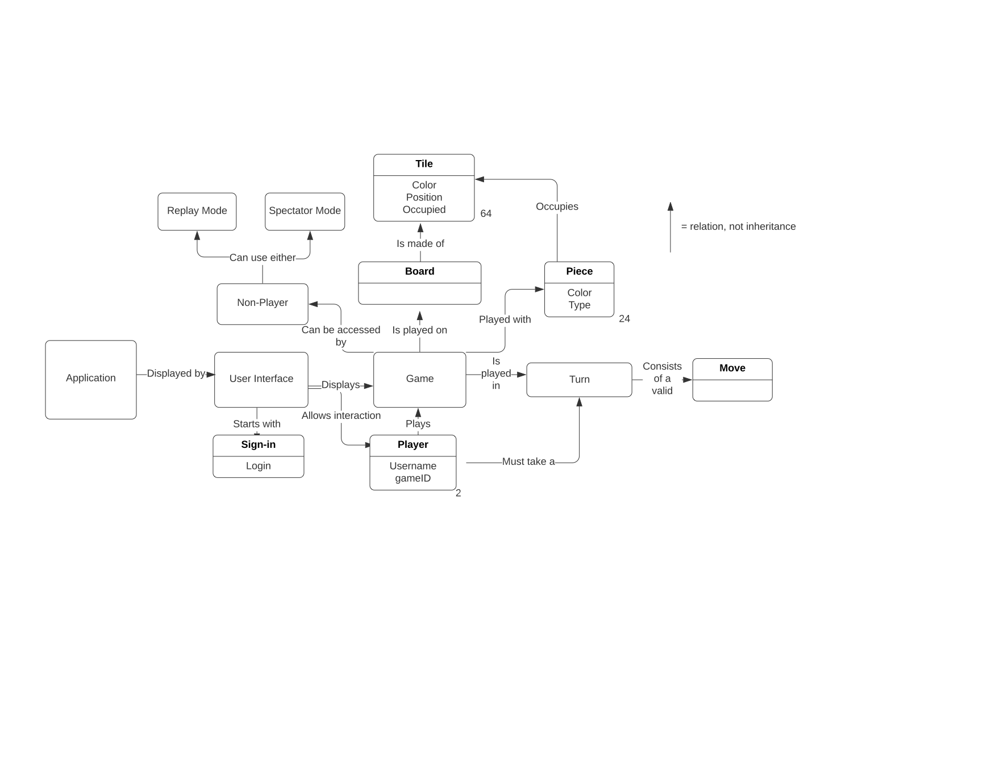
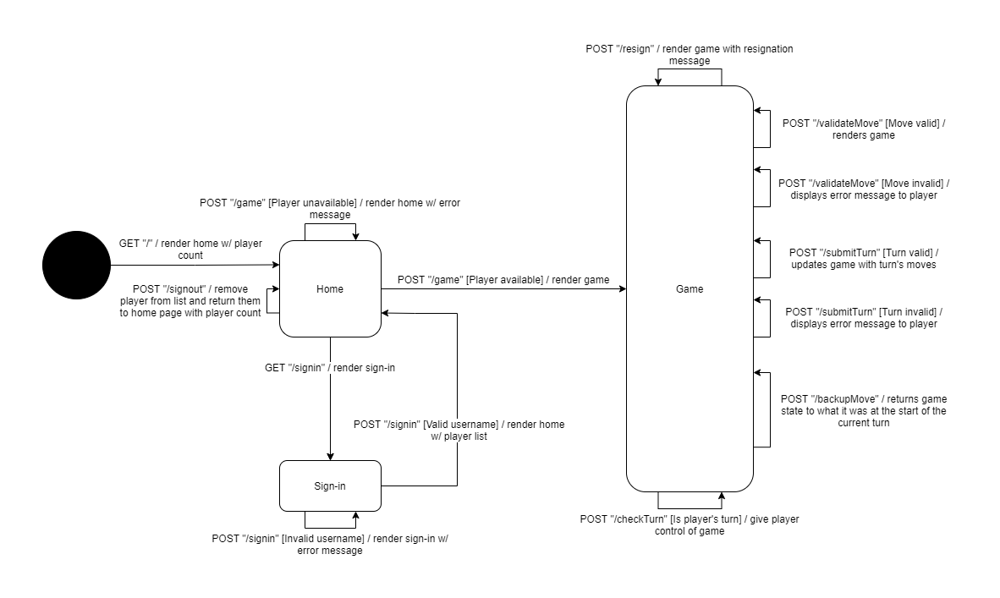

# PROJECT Design Documentation

> _The following template provides the headings for your Design
> Documentation.  As you edit each section make sure you remove these
> commentary 'blockquotes'; the lines that start with a > character
> and appear in the generated PDF in italics._

## Team Information
* Team name: Team 5
* Team members
  * William Tietjen
  * Anthony Salvati
  * Nabeel Khan
  * Trevor Cruz
  * Kyle Reddy

## Executive Summary

This is a summary of the project.

### Purpose

This project is a checkers web app split into 3 tiers, UI, model,
and application. The checkers game follows the American rules. The most
important user group is the players with a focus on user goals such as
signin, starting a game, game functionality, and several enhancements.

### Glossary and Acronyms
> _Provide a table of terms and acronyms._

| Term | Definition |
|------|------------|
| VO | Value Object |

## Requirements

This section describes the features of the application.

> _In this section you do not need to be exhaustive and list every
> story.  Focus on top-level features from the Vision document and
> maybe Epics and critical Stories._

### Definition of MVP
The MVP must allow users to sign-in in order to play
a game and sign-out when they are done. Fully functioning games
are expected that follow the [American Rules](https://www.se.rit.edu/~swen-261/projects/WebCheckers/American%20Rules.html) 
of checkers. Player's of a game are able to resign at certain
points which will immediately end the game.

### MVP Features
* Start a Game - As a Player I want to start a game so that I can play checkers with an opponent
* Player Sign-in - As a Player I want to sign-in so that I can play a game of checkers
* Making a Move - As a	Player I want to make a move if I have one so that I don’t lose the game
* Signing Out - As a player I want to be able to sign out so that I can retire my username when I am done
* Alternate Turns - As a Player I want my turn to end after I’ve made a move so that my opponent can move
* Resigning - As a Player I want to be able to resign so that I can play another game
* Capture Pieces - As a Player I want to capture a piece after a jump so that I get ahead in the game
* Kinging a Piece - As a Player I want to have my piece turn into a king if I reach the end of the board so that I can move back down the board
* Exiting a Game - As a player I want to be able to exit the game when it is over so that I can start a new one

### Roadmap of Enhancements
* Replay Game - users will have the ability to go back and 
  review their old games turn by turn.
* Spectate Game - other users will have the option to spectate
  ongoing games as they happen.

## Application Domain

This section describes the application domain.

The application starts out with a user interface allowing the player to sign in. The sign in 
requires the user to provide a unique username, which is checked by the PlayerLobby.
The GameManager connects two players,one red and one white, and assigns them to a CheckersGame. 
The game consists of a CheckerBoard which holds all of the CheckerPieces that players move around. 
Each player takes a turn during the CheckersGame, moving a piece until a player has no pieces or resigns. 
A move consists of either a simple move or a jump, which can be done multiple times if available. 

## Architecture and Design

This section describes the application architecture.

### Summary

The following Tiers/Layers model shows a high-level view of the webapp's architecture.

As a web application, the user interacts with the system using a
browser.  The client-side of the UI is composed of HTML pages with
some minimal CSS for styling the page.  There is also some JavaScript
that has been provided to the team by the architect.

The server-side tiers include the UI Tier that is composed of UI Controllers and Views.
Controllers are built using the Spark framework and View are built using the FreeMarker framework.  The Application and Model tiers are built using plain-old Java objects (POJOs).

Details of the components within these tiers are supplied below.

### Overview of User Interface

This section describes the web interface flow; this is how the user views and interacts
with the WebCheckers application.

Upon reaching the home page, a user who has not signed in will be given a sign-in button. When they click the sign-in
button they will be sent to the sign-in page where they must enter a username in a text box and click the submit button. 
Once they do so successfully, they will be taken back to the homepage, this time in the signed-in state. A list of
currently signed-in players will now be visible to this user. When the user clicks on a player's name in this list they 
will be placed in a new checkers game with them if they are still signed-in and not already in a game, otherwise the 
user will be given an error message, and they will remain on the homepage.

Once in a game, the player will have a board in front of them, a UI display that tells them which pieces they control,
and a set of buttons which will swap between being clickable and non-clickable based on the game state. Once it is their
turn in the game, the player will be given the ability to move a piece on the board to a different space. If the move
they perform is impossible the piece will not be placed in the new location and a message explaining why will be
displayed in the info section. If the player makes a valid move, the space the piece moved from and the new space the
piece is on will appear green. If the player decides that their valid move is not the one they wish to make, they can
press the "Backup" button which will revert the game state to the state it was in when they started their turn. Once the
player is satisfied with their move choice, they must click "Submit turn" to finalize their choice. When the player 
submits their turn, the board will be updated to its new state and control will be passed to the player's opponent. If
at any time during the game the player wishes to leave, they may click "Resign", which will end the game and announce 
their resignation to their opponent.

### UI Tier
> _Provide a summary of the Server-side UI tier of your architecture.
> Describe the types of components in the tier and describe their
> responsibilities.  This should be a narrative description, i.e. it has
> a flow or "story line" that the reader can follow._

> _At appropriate places as part of this narrative provide one or more
> static models (UML class structure or object diagrams) with some
> details such as critical attributes and methods._

> _You must also provide any dynamic models, such as statechart and
> sequence diagrams, as is relevant to a particular aspect of the design
> that you are describing.  For example, in WebCheckers you might create
> a sequence diagram of the `POST /validateMove` HTTP request processing
> or you might show a statechart diagram if the Game component uses a
> state machine to manage the game._

> _If a dynamic model, such as a statechart describes a feature that is
> not mostly in this tier and cuts across multiple tiers, you can
> consider placing the narrative description of that feature in a
> separate section for describing significant features. Place this after
> you describe the design of the three tiers._

### Application Tier
> _Provide a summary of the Application tier of your architecture. This
> section will follow the same instructions that are given for the UI
> Tier above._

### Model Tier
> _Provide a summary of the Application tier of your architecture. This
> section will follow the same instructions that are given for the UI
> Tier above._

### Design Improvements
> _Discuss design improvements that you would make if the project were
> to continue. These improvement should be based on your direct
> analysis of where there are problems in the code base which could be
> addressed with design changes, and describe those suggested design
> improvements. After completion of the Code metrics exercise, you
> will also discuss the resutling metric measurements.  Indicate the
> hot spots the metrics identified in your code base, and your
> suggested design improvements to address those hot spots._

## Testing

### Acceptance Testing

As of sprint 2, all acceptance criteria for the implemented user stories have been met. 

### Unit Testing and Code Coverage
> _Discuss your unit testing strategy. Our strategy for unit testing was 
> For unit testing Report on the code coverage
> We have an overall code coverage of 
> achieved from unit testing of the code base. Discuss the team's
> coverage targets, why you selected those values, and how well your
> code coverage met your targets. If there are any anomalies, discuss
> those._
